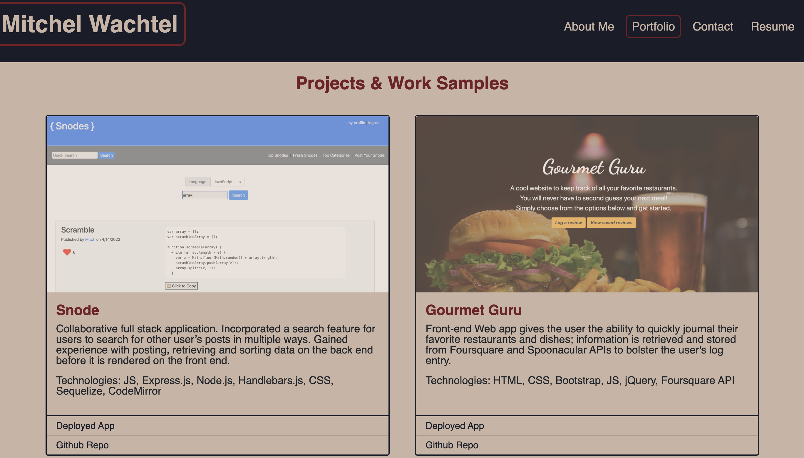
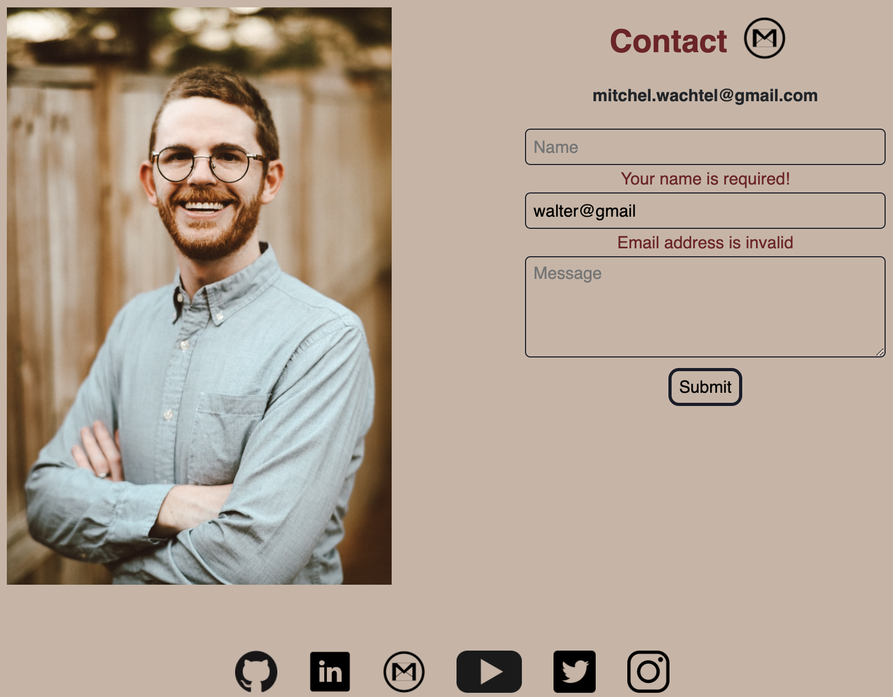

# Portfolio with ReactJS

## Mitchel Wachtel - mitchel.wachtel@gmail.com

---

### Description

This is a single page APP portfolio for Mitchel Wachtel built using ReactJS. When the user loads the site, they are presented with the homepage, that displays the 'About Me' information along with a beautiful banner photo. The NavBar and Footer will present themselves on each screen. The NavBar has buttons for "About Me", "Contact", "Portfolio", and "Resume". The Footer has icons that allow the user to go to Mitchel Wachtel's Github, LinkedIn, Youtube, Instagram, and Email. When the user clicks on a NavBar icon, it remains selected at the top. The Portfolio screen has several projects with a screenshot & links to their deployment and github repo. The Resume section has a summary and a link to download the Resume. The Contact screeen has inputs for Name, Email, and Message that validate the input.

---

### Table of contents

- [Installation](#installation)
- [Technology](#technology)
- [Usage](#usage)
- [License](#license)
- [Contributing](#contributing)
- [Tests](#tests)
- [Questions](#questions)

---

### Installation

To install the dependencies necessary to run use the application, the user should run the following command:

`npm i`

---

### Technology

Technologies used: ReactJS, JS, HTML, CSS, Bootstrap, node.js, npm, dependencies: 'axios', 'bootstrap', 'gh-pages', 'react', 'react-dom', 'react-scripts', 'dotenv', 'web-vitals', and VS Code.

---

### Usage

The application can be found *[here](https://boiling-ravine-98433.herokuapp.com/)* deployed on Github Pages. 

---

---

---

### License

Read more about the MIT License _[here](https://opensource.org/licenses/MIT)_.

---

### Contributing

Please contact mitchel.wachtel@gmail.com if you have any desire to contribute to this project.

---

### Tests

No tests are currently set up for this application.

---

### Questions

If you have any questions, please send me an email at mitchel.wachtel@gmail.com and I'll be quick to get back to you! You can also open an issue on GitHub. Find me on GitHub at https://github.com/mitchelwachtel if you are interested in any of my other work.
